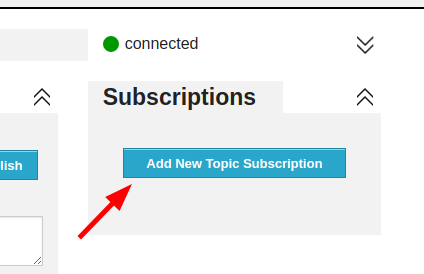
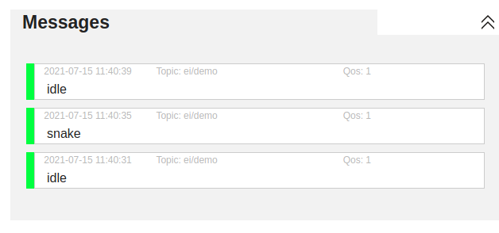

# Edge Impulse firmware for nRF9160 DK

[Edge Impulse](https://www.edgeimpulse.com) enables developers to create the next generation of intelligent device solutions with embedded Machine Learning. This repository contains the Edge Impulse firmware for the Nordic Semiconductor nRF9160 DK development boards, in combination with the ST IKS02A shield. This combination supports all Edge Impulse device features, including ingestion, remote management and inferencing.

> **Note:** Do you just want to use this development board with Edge Impulse? No need to build this firmware. See [these instructions](https://docs.edgeimpulse.com/docs/nordic-semi-nrf9160-dk) for prebuilt images and instructions, or use the [data forwarder](https://docs.edgeimpulse.com/docs/cli-data-forwarder) to capture data from any sensor.

## Requirements

**Hardware**

* Nordic Semiconductor [nRF9160 DK](https://docs.edgeimpulse.com/docs/nordic-semi-nrf9160-dk) development board.
* [X-NUCLEO-IKS02A1](https://www.st.com/en/ecosystems/x-nucleo-iks02a1.html) shield.

    > No IKS02A1 shield? You can modify this firmware relatively easily to work with other accelerometers or PDM microphones that are supported in Zephyr. See [Working with other sensors](#working-with-other-sensors).

**Software**

* [nRF Connect SDK](https://www.nordicsemi.com/Software-and-tools/Software/nRF-Connect-SDK) - make sure you select version v1.6.0.
* [GNU ARM Embedded Toolchain 9-2019-q4-major](https://developer.arm.com/tools-and-software/open-source-software/developer-tools/gnu-toolchain/gnu-rm/downloads).
* [nRF Command Line Tools](https://www.nordicsemi.com/Software-and-tools/Development-Tools/nRF-Command-Line-Tools/Download).

Or you can build this application with Docker (see below).

## Building the device firmware (locally)

1. Install and configure the nRF Connect SDK:
    1. [nRF Connect SDK](https://developer.nordicsemi.com/nRF_Connect_SDK/doc/latest/nrf/gs_installing.html) in a *separate* folder from this repository (e.g. `~/repos/ncs`).
    1. Check out NCS version 1.6.0:

        ```
        $ cd ~/repos/ncs/nrf
        $ git checkout v1.6.0
        $ cd ..
        $ west update
        ```

    1. Set your `ZEPHYR_BASE` environment variable to `~/repos/ncs/zephyr`.

1. Clone this repository:

    ```
    $ git clone https://github.com/edgeimpulse/firmware-nrf91
    ```

1. You'll need to flash the board controller *once*:

    1. Ensure that the `PROG/DEBUG` switch is in `nRF52` postion.

        

    1. Run:

        ```
        $ cd board-controller/
        $ west build -b nrf9160dk_nrf52840@1.0.0
        $ west flash
        ```

1. Build and flash the application:

    1. Ensure that the `PROG/DEBUG` switch is in `nRF91` postion.

        

    1. Build the application (make sure you're in the `firmware-nrf91` folder again, not in the `board-controller`!):

        ```
        $ west build -b nrf9160dk_nrf9160ns@1.0.0
        ```

    1. Flash the application:

        ```
        $ west flash
        ```

## Building the device firmware (Docker)

1. Clone this repository:

    ```
    $ git clone https://github.com/edgeimpulse/firmware-nrf91
    ```

1. Build the Docker container:

    ```
    $ docker build -t edge-impulse-nordic .
    ```

1. You'll need to flash the board controller *once*:

    1. Ensure that the `PROG/DEBUG` switch is in `nRF52` postion.

        

    1. Run:

        ```
        $ docker run --rm -v $PWD:/app edge-impulse-nordic /bin/bash -c "cd board-controller && west build -b nrf9160dk_nrf52840@1.0.0"
        ```

    1. Copy `board-controller/build/zephyr/zephyr.bin` to the `JLINK` mass storage device.


1. Build and flash the application:

    1. Ensure that the `PROG/DEBUG` switch is in `nRF91` postion.

        

    1. Build the application:

        ```
        $ docker run --rm -v $PWD:/app edge-impulse-nordic /bin/bash -c "west build -b nrf9160dk_nrf9160ns@1.0.0"
        ```

    1. Copy `build/zephyr/zephyr.bin` to the `JLINK` mass storage device.


## MQTT demo

To see the output of inference process, make to following steps after deploying ML model:
1. Insert SIM Card to nRF9160DK and power cycle the board.
1. Open Serial Port Terminal of the nRF9160DK (use first port eg. `ttyACM0` on Linux) on baud rate 115,200.
1. Connect the board to MQTT server via:

    ```
    AT+CONNECT
    ```

    The connection can take while and as a result you should get the `OK` response or `ERROR` if something went wrong.

1. After successfull connection run the model:

    ```
    AT+RUNIMPULSE
    ```

    or:

    ```
    AT+RUNIMPULSECONT
    ```

1. Open [HiveMQ Online MQTT Client](http://www.hivemq.com/demos/websocket-client/) and click `Connect`

    

1. After connection, click `Add New Topic Subscription`, in the dialog enter topic `ei/demo` and click `Subscribe`

    

    

1. After that you should start seeing messages incoming from `nRF9160DK`

    
